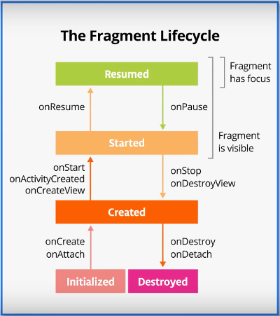

# Жизненный цикл

## Оглавление

- [Введение](#введение)
- [Состояния жизненного цикла](#состояния-жизненного-цикла)
- [Логирование состояний жизненного цикла](#логирование-состояний-жизненного-цикла)

## Введение

В архитектуре Android-приложений активности являются короткоживущими компонентами. Они могут автоматически создаваться и уничтожаться в различных ситуациях, например в случае изменения ориентации экрана или нехватки памяти для других приложений. Кроме того, активность может переходить в фон или на передний план.

Для правильной обработки всех этих ситуаций вводится понятие **жизненного цикла** активности и предоставляются средства, позволяющие выполнять те или иные действия при переходе между различными состояниями этого жизненного цикла.

На изображениях ниже изображены жизненные циклы активности и фрагмента. Далее речь пойдет именно о жизненном цикле активности, поскольку жизненный цикл фрагмента похож на жизненный цикл активности.

 

## Состояния жизненного цикла

Активность имеет следующие состояния жизненного цикла:

* **Created** — активность создана, находится в фоне и пользователь еще не может с ней взаимоействовать.
* **Started/Resumed** — активность запущена и находится на переднем плане приложения, пользователь может с ней взаимодействовать.
* **Paused** — активность запущена и находится на переднем плане, но пользователь не может с ней взаимодействовать, т.е. активность перекрыта всплывающим окном или диалогом.
* **Stopped** — активность находится в фоне и не отображается на экране и пользователь не может с ней взаимодействовать.
* **Destroyed** — активность уничтожена.

Для отслеживания состояний жизненного цикла каждая активность (и фрагменты) имеет специальные методы-callback'и (у фрагментов названия методов могут отличаться, см. изображение выше): `onCreate()`, `onStart()`, `onResume()`, `onPause()`, `onStop()`, `onDestroy()`.

**Метод `onCreate()`:**

`onCreate()` - первый метод, с которого начинается выполнение активности. В этом методе активность переходит в состояние **Created**. Он вызывается непосредственно после создания активности. Здесь осуществляется инициализация интерфейса пользователя, привязка данных к элементам интерфейса, создание потоков и т.д.

**Метод `onStart()`:**

В методе `onStart()` осуществляется подготовка к отображению активности на экране устройства. Обычно, этот метод не требует переопределения, а всю работу производит встроенный код активности. После завершения работы метода активность показывается на экране, вызывается метод `onResume()`, и активность переходит в состояние **Resumed**.

**Метод `onResume()`:**

При вызове метода `onResume()` активность переходит в состояние **Resumed**, отображается на экране и пользователь может с ней взаимодействовать. До тех пор пока активность не потеряет фокус она находится в этом состоянии. Фокус активность может потерять вследствии переключения пользователя на другую активность или из-за выключения экрана устройста.

**Метод `onPause()`:**

Метод `onPause()` вызывается, когда пользователь переходит от одной активности к другой. В этом методе можно освобождать используемые ресурсы, приостанавливать процессы, например, воспроизведение аудио, анимаций. После вызова этого метода активность становится невидимой, не отображается на экране, но она все еще активна. Если пользователь решит вернуться к этой активности, то система вызовет метод `onResume()`, и активность снова появится на экране.

**Метод `onStop()`:**

Метод `onStop()` переводит активность в состяние **Stopped**. Метод освобождает неиспользуемые русурсы, которые использует активность. При этом сама активность остается в памяти устройства и состоение всех элементов интерфейса сохраняется. Если пользователь решит вернуться к активности, также будет вызван метод `onResume()` и активность будет отображена на экране.

**Метод `onDestroy()`:**

Метод `onDestroy()` вызывается, когда активность завершает свою работу. Метод может быть вызван, либо, когда система решает "убить" активность, если системе не хватает ресурсов, либо, если пользователь "убивает" приложение самостоятельно. Также метод `onDestroy()` вызывается при смене ориентации устройства, а затем активность создается заново, вызывая метод `onCreate()`.

## Логирование состояний жизненного цикла

// In Progress
